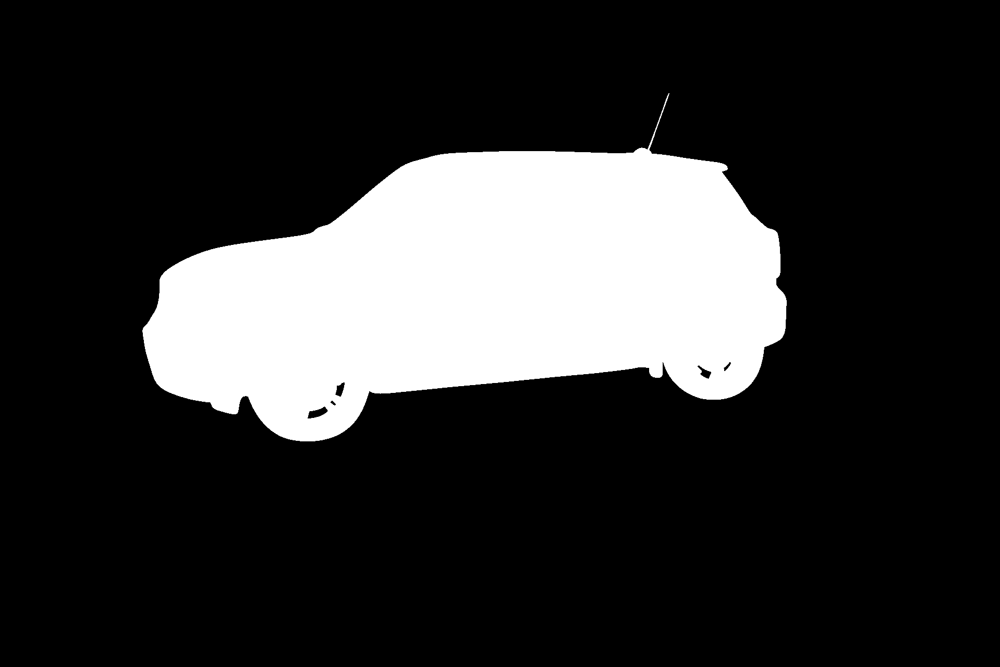
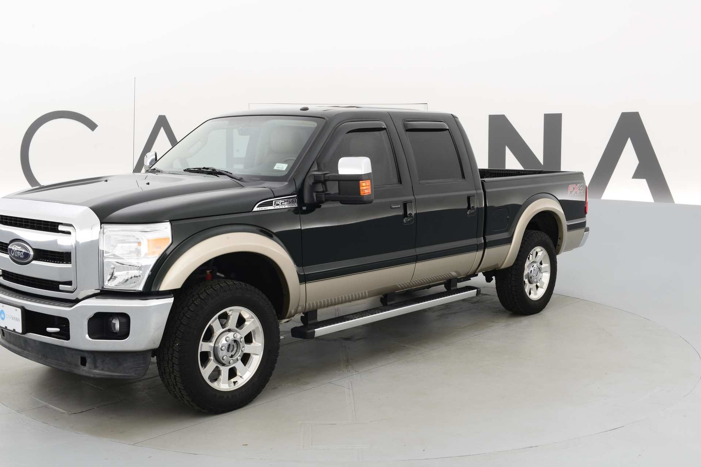
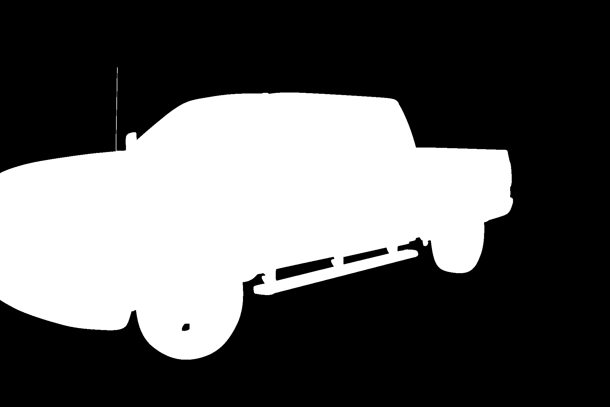

# UNET Instance Segmentation with Streamlit

This project implements UNET for image segmentation using PyTorch and Streamlit for the user interface. The application allows users to upload or select test images and visualize predicted masks.

---

## Features
- **UNET Model**: Implemented for semantic segmentation.
- **Streamlit Interface**: Interactive interface for selecting and predicting images.
- **Pre-trained Weights**: Load and use pre-trained model weights.
- **Data Augmentation**: Utilizes Albumentations for preprocessing.

---

## Requirements

### Environment
- Python 3.8 or later
- CPU or GPU (optional)

### Libraries
- `torch`
- `torchvision`
- `streamlit`
- `PIL`
- `albumentations`
- `numpy`
- `matplotlib`
- `tqdm`

Install dependencies using pip:

```bash
pip install -r requirements.txt
```

---

## Project Structure

```plaintext
.
├── app.py               # Streamlit interface
├── dataset.py           # Dataset loader
├── model.py             # UNET model implementation
├── test_data.py         # Script for single-image testing
├── train.py             # Training script
├── utils.py             # Utility functions
├── requirements.txt     # Python dependencies
├── data/
│   ├── train_images/    # Training images
│   ├── train_masks/     # Training masks
│   ├── val_images/      # Validation images
│   ├── val_masks/       # Validation masks
│   ├── test_images/     # Images for testing
├── my_checkpoint.pth.tar # Trained model weights
└── saved_images/        # Directory for saving predictions
```

---

## Usage

### 1. Train the Model
To train the model, modify paths and parameters in `train.py` and run:
```bash
python train.py
```

---

### 2. Run Streamlit App
Launch the Streamlit application for testing:
```bash
streamlit run app.py
```

---

### 3. Test a Single Image
To test a specific image and visualize results:
```bash
python test_data.py
```

---

## Example Output

Below is an example of the model's performance:

### Original Image


### Predicted Mask


### Original Image


### Predicted Mask


### Original Image


### Predicted Mask

---

## Notes
- Ensure the `data` folder contains proper images and masks in the correct structure.
- Modify paths in scripts (`app.py`, `train.py`, `test_data.py`) as needed.
- Pre-trained weights are saved as `my_checkpoint.pth.tar`.

Happy coding!
